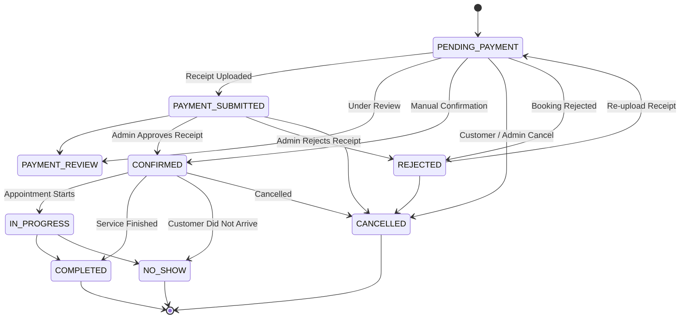
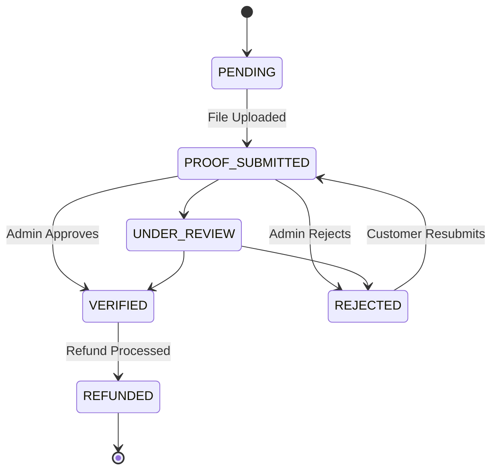

# Domain Model & Lifecycles — Reservy

Reservy models service booking with generic, domain-driven entities decoupled from any single vertical (such as salons, clinics, consultants, gyms, or tutors).

---

## 1. Core Domain Entities

### Organization & Tenancy
- **Tenant**: Top-level account entity for multi-organization companies.
- **Organization**: The business profile (`name`, `slug`, `timezone`, `currency`, `locale`).
- **Location**: Physical branch or virtual venue (`address`, `phone`, `timezone`).
- **User & Membership**: System identity mapped to organizations via roles (`OWNER`, `MANAGER`, `STAFF`, `RECEPTIONIST`).

### Catalog & Staff
- **ServiceCategory**: Grouping of services (`name`, `sortOrder`).
- **Service**: Bookable service item (`durationMinutes`, `price`, `depositAmount`, `bufferBeforeMinutes`, `bufferAfterMinutes`).
- **StaffMember**: Service provider (`displayName`, `bio`, `avatarUrl`, `isBookable`, `isActive`).
- **StaffService**: Many-to-many relationship with optional custom price & duration overrides.
- **Resource**: Rooms, chairs, equipment, or courts (`type`, `capacity`, `isActive`).

### Availability & Scheduling
- **StaffSchedule**: Weekly working shift intervals (`shiftsJson`, `breaksJson`, `isDayOff`).
- **BlockedPeriod**: Time-off, maintenance, or manual blocks (`startAt`, `endAt`, `reason`).

### Booking Domain
- **Customer**: Organization-scoped customer profile (`fullName`, `phone`, `notes`, `metadataJson`).
- **Booking**:
  - `code`: User-facing alphanumeric code (e.g. `BK-8F2K9D`).
  - `accessToken`: Cryptographic token for unauthenticated customer status tracking.
  - Snapshots: `serviceNameSnapshot`, `staffNameSnapshot`, `priceSnapshot`, `durationSnapshot`.
  - Timestamps: `startAt`, `endAt`, `cancelledAt`, `completedAt`.

### Payment & Audit
- **CardAccount**: Organization bank card account details (`cardNumber`, `cardHolderName`, `bankName`).
- **Payment**: Monetary transaction record (`method`, `amount`, `status`, `referenceNumber`).
- **PaymentProof**: Customer receipt upload (`fileUrl`, `mimeType`, `fileSize`, `reviewStatus`, `rejectionReason`).
- **AuditLog**: Immutable historical audit trail for sensitive administrative operations.

---

## 2. Booking State Machine

---

## 3. Payment State Machine

---

## 4. Money & Currency Architecture
- Money is stored strictly as integer values in smallest units (Tomans/Rials). Floating-point variables are prohibited for currency calculation.
- Display formatting (`formatToman`) is isolated to the presentation layer.
